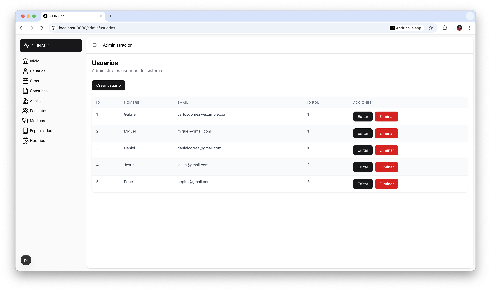
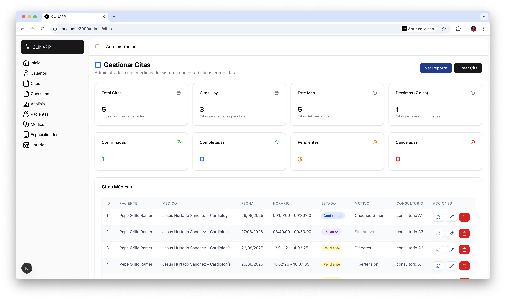
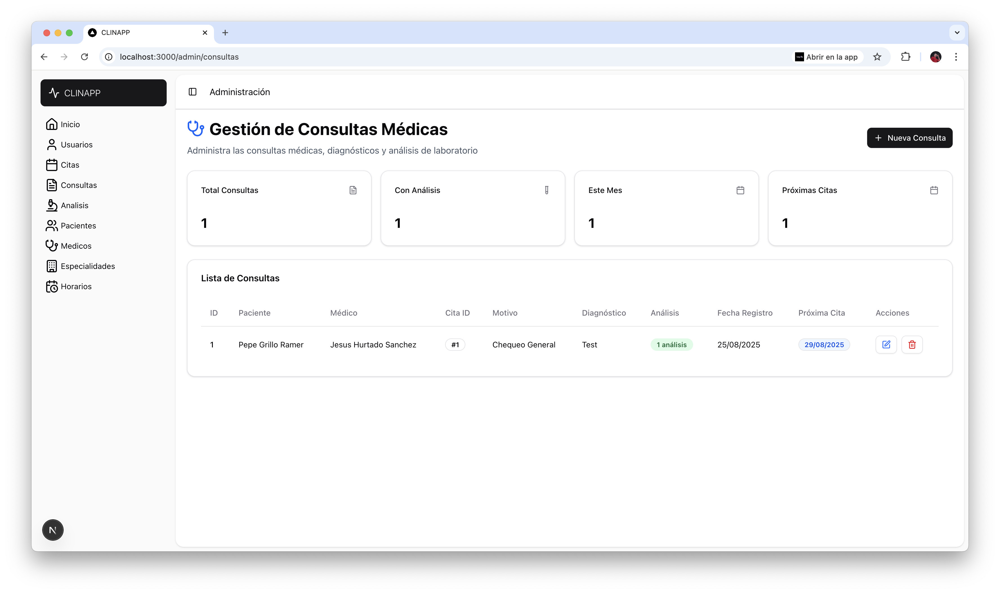
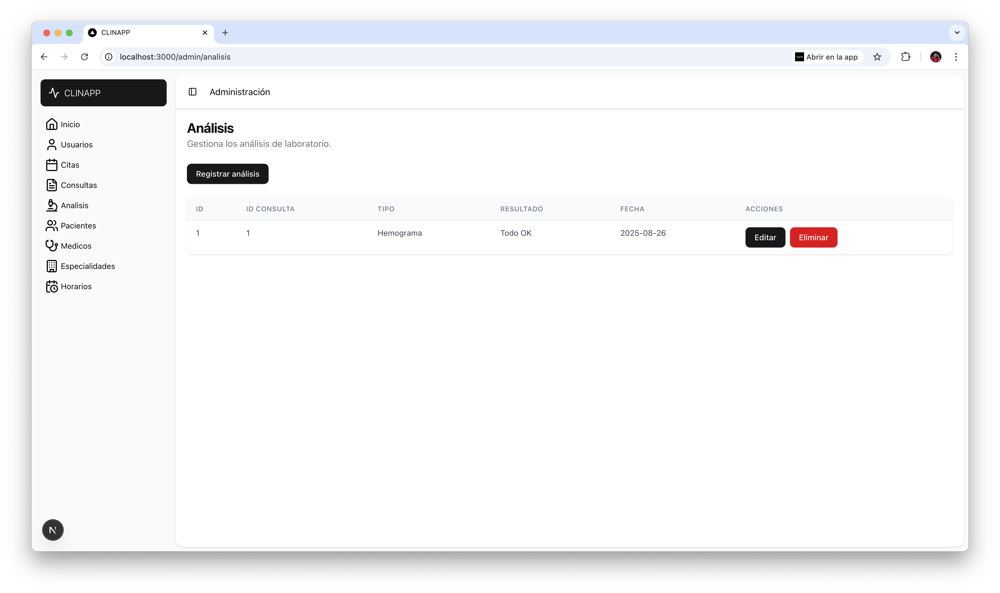

# Proyecto Clinica Front

Este proyecto es una aplicación web desarrollada con Next.js, pensada como el frontend para una clínica. Permite gestionar y visualizar información médica, citas, especialidades y más.

## Instalación y ejecución rápida

1. **Instala las dependencias:**
	```bash
	npm install
	# o
	yarn install
	# o
	pnpm install
	# o
	bun install
	```

2. **Inicia el servidor de desarrollo:**
	```bash
	npm run dev
	# o
	yarn dev
	# o
	pnpm dev
	# o
	bun dev
	```

3. **Abre tu navegador en** [http://localhost:3000](http://localhost:3000) para ver la aplicación.

## Estructura básica

- El código fuente está en la carpeta `src/`.
- Puedes editar la página principal en `src/app/page.tsx`.
- Los componentes reutilizables están en `src/components/`.

## Recursos útiles

- [Documentación Next.js](https://nextjs.org/docs)
- [Tutorial interactivo Next.js](https://nextjs.org/learn)

## Despliegue

La forma más sencilla de desplegar el proyecto es usando [Vercel](https://vercel.com/new?utm_medium=default-template&filter=next.js&utm_source=create-next-app&utm_campaign=create-next-app-readme).

## Capturas de pantalla








